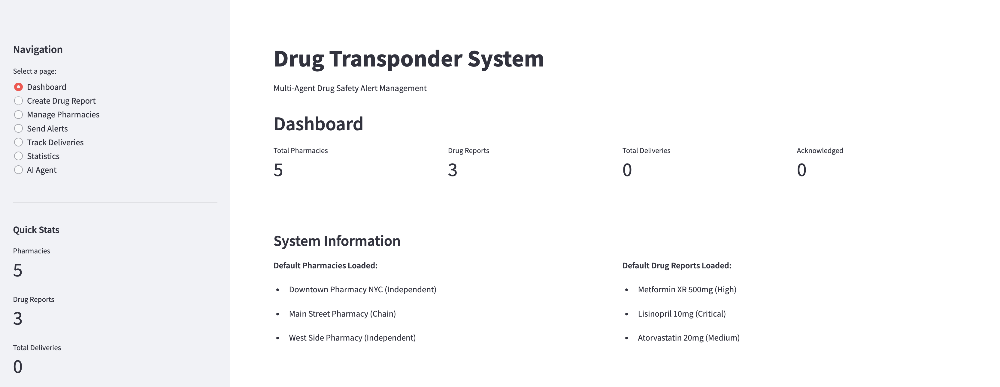
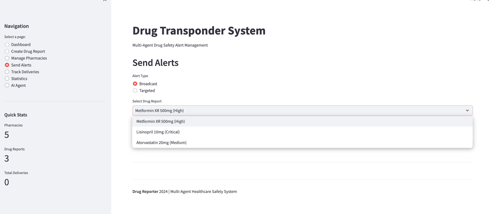

# Drug Reporter

A multi-agent system for managing and distributing drug safety alerts to pharmacies with delivery tracking and acknowledgment management.

This system uses AI-powered agents (Claude) to intelligently route drug safety alerts to pharmacies. It includes comprehensive delivery receipt tracking to ensure pharmacies acknowledge critical alerts.

## Features

- **Multi-Agent Architecture**: Broadcast and Targeted agents for different alert scenarios
- **Delivery Receipt Tracking**: Track sent, acknowledged, pending, and failed deliveries
- **Acknowledgment Management**: Monitor which pharmacies have confirmed receipt
- **Follow-up Support**: Identify pharmacies needing reminders
- **Real-time Statistics**: Dashboard showing delivery metrics
- **AI Agent Interface**: Natural language control via LangChain integration

## Installation

```bash
# Clone the repository
git clone <repository-url>
cd DrugIt

# Create virtual environment
python -m venv .venv
source .venv/bin/activate  # Windows: .venv\Scripts\activate

# Install dependencies
pip install -r requirements.txt
```

## Requirements

```
anthropic
streamlit
python-dotenv
langchain
langchain-anthropic
langchain-core
plotly
```

## Configuration

Create a `.env` file:

```
ANTHROPIC_API_KEY=your_api_key_here
```

## Usage

### CLI Mode

```bash
python main.py
```

Processes all drug reports automatically, routing to appropriate agents.

### Web Interface

```bash
streamlit run app.py
```

###  Interactive dashboard for:
- Viewing and creating drug reports
- Adding pharmacies
- Sending alerts (broadcast or targeted)
- Tracking acknowledgments
- Viewing delivery statistics
- AI Agent for natural language commands

 


## AI Agent

The AI Agent page allows you to control the system using natural language instead of navigating through menus.

 

### Example Commands

**Creating and Sending Alerts:**
- "Create a critical recall for Metformin due to contamination and broadcast to all pharmacies"
- "Send a targeted alert for Lisinopril to Northeast region only"

**Checking Status:**
- "Check delivery statistics"
- "Send follow-up reminders to pharmacies that have not acknowledged"

**Multi-step Workflows:**
- "Create a high severity warning for Ibuprofen about packaging issues, send to Midwest and West regions, then check the delivery status"



### How It Works

The AI Agent uses LangChain to wrap existing system components as tools:

| Tool | Description |
|------|-------------|
| `load_sample_pharmacies` | Load sample pharmacy data |
| `create_drug_report` | Create a new drug safety report |
| `broadcast_alert` | Send alert to ALL pharmacies |
| `targeted_alert` | Send alert to specific regions |
| `check_delivery_statistics` | View acknowledgment rates |
| `send_followup_reminders` | Remind non-responsive pharmacies |

Claude analyzes your natural language input and automatically calls the appropriate tools in the correct order.

## Project Structure

```
DrugIt/
├── main.py                  # CLI orchestrator
├── app.py                   # Streamlit web interface
├── agents.py                # Broadcast and Targeted agent classes
├── models.py                # Data models
├── utils.py                 # Utility functions
├── langchain_tools.py       # LangChain tool wrappers
├── langchain_agent.py       # LangChain agent orchestrator
├── delivery_receipt_manager.py
├── .env                     # API key configuration
├── requirements.txt         # Dependencies
└── README.md
```

## Architecture

```
User Input (Natural Language)
        |
        v
+------------------+
|  LangChain Agent |  (langchain_agent.py)
+------------------+
        |
        v
+------------------+
|  Tool Wrappers   |  (langchain_tools.py)
+------------------+
        |
        v
+------------------+
|  Existing Agents |  (agents.py)
|  - Broadcast     |
|  - Targeted      |
+------------------+
        |
        v
+------------------+
|   Pharmacies     |
+------------------+
```

## License

MIT Open Source License
